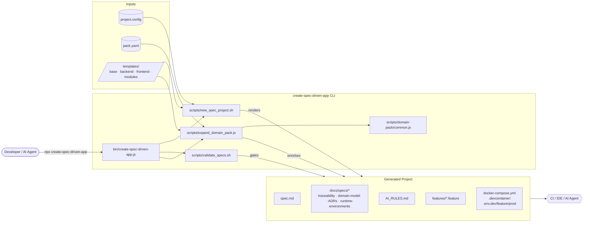
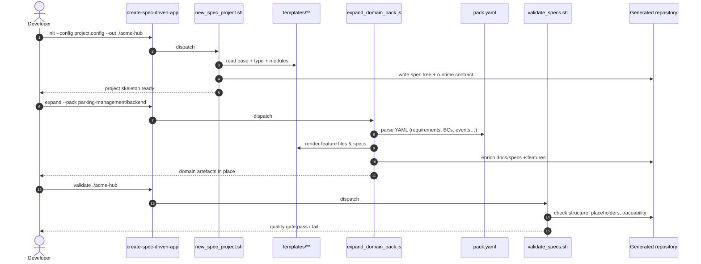

# `create-spec-driven-app` — Project Report

> A professional overview of the project, its value for enterprise software
> delivery, the engineering disciplines it embodies, and its architecture.

---

## 1. Executive Summary

`create-spec-driven-app` is an open-source npm CLI that scaffolds new
software projects around **executable specifications** rather than code
boilerplate. Instead of starting from an empty repository and discovering
requirements during implementation, teams start from a specification tree
that already encodes their domain, their acceptance criteria, their
architectural decisions, and their runtime contract.

The tool combines four well-established engineering disciplines —
**Spec-Driven Development (SDD)**, **Domain-Driven Design (DDD)**,
**Behavior-Driven Development (BDD)** and **Test-Driven Development
(TDD)** — into a single, opinionated workflow. It produces project
skeletons that are immediately reviewable by domain experts, executable by
engineers, and auditable by AI assistants.

The current snapshot, on branch
`codex/runtime-env-docker-devcontainer`, extends that workflow with a
production-grade runtime contract: Docker Compose services, devcontainer
configuration, and multi-environment `.env` files for `dev`, `feature` and
`prod`.

---

## 2. Project Purpose and Vision

Most software projects fail not because the code is wrong, but because the
requirements were never agreed upon in a form that could be tested.
Documents drift, tickets fragment intent, and the resulting codebase
becomes the only source of truth — a source of truth that no business
stakeholder can read.

`create-spec-driven-app` exists to close that gap. Its vision is:

> **Specifications should be the primary artefact of a software project.
> Code, infrastructure and tests are derived from them and remain
> traceable to them.**

Concretely, the tool generates:

- A root `spec.md` describing the product, its bounded contexts and its
  success criteria.
- A `docs/specs/` tree with domain model, aggregates, commands, events,
  use cases, traceability matrix and Architecture Decision Records (ADR).
- An `AI_RULES.md` file that constrains AI assistants to the chosen stack
  and conventions.
- Gherkin `*.feature` files that turn each requirement into an executable
  acceptance test.
- A runtime contract (`docker-compose.yml`, `.devcontainer/`,
  `.env.{dev,feature,prod}`) so that the project boots identically on
  every developer's machine and in CI.
- Optional **domain packs** (`auth`, `billing`, `dashboard`, custom YAML
  packs) that pre-populate the spec tree with proven patterns.

---

## 3. Value Proposition

| Stakeholder              | What they get                                                                 |
| ------------------------ | ----------------------------------------------------------------------------- |
| Product owners           | A reviewable spec tree before any code is written; requirements stay current. |
| Domain experts           | A ubiquitous-language glossary and an explicit aggregate / event model.       |
| Engineering leads        | ADRs, a traceability matrix, and quality gates enforced by `validate`.        |
| Developers               | An IDE-ready devcontainer, a working Compose stack and clear AI guardrails.   |
| QA / SDETs               | Gherkin scenarios that double as living documentation and regression tests.   |
| AI coding assistants     | `AI_RULES.md` and structured specs that reduce hallucination and rework.      |
| Security and compliance  | A documented runtime contract, environment isolation and ADR audit trail.    |

---

## 4. Why This Matters for Enterprise Software

Enterprise software is defined less by scale than by **constraints**:
regulatory obligations, cross-team contracts, multi-year lifespans, and
a heterogeneous mix of human and automated contributors. In that context,
tooling like `create-spec-driven-app` delivers concrete benefits:

1. **Compressed time-to-clarity.** A new initiative reaches a shared
   understanding of scope in hours, not weeks, because the spec tree is
   the conversation, not the byproduct of one.
2. **Reduced rework.** Disagreements surface during spec review, where
   they cost a paragraph rewrite, instead of during integration testing
   where they cost a sprint.
3. **Auditability by design.** Every requirement is linked, via the
   traceability matrix, to a scenario, an aggregate, an event, a feature
   file and a technical artefact. Auditors get a single, navigable trail.
4. **AI-readiness.** Large language models are increasingly part of the
   delivery pipeline. A structured spec tree and an `AI_RULES.md` file
   keep AI contributions inside the architectural envelope of the
   project, dramatically reducing review burden.
5. **Onboarding velocity.** New engineers, contractors and vendors begin
   from a self-describing repository: what the system does, why, and how
   to run it locally are all in version control.
6. **Reproducible runtime.** Multi-environment `.env` files, Docker
   Compose and devcontainer eliminate the "works on my machine" class of
   defects from day one.
7. **Portability across stacks.** The same SDD/DDD/BDD/TDD scaffolding
   applies whether the team builds in Quarkus, FastAPI, NestJS or React.
   Process is decoupled from platform.

---

## 5. Methodologies Embodied by the Tool

### 5.1 Spec-Driven Development (SDD)

SDD treats the **specification as the primary deliverable** of a phase
of work, with code, tests and infrastructure derived from it. A spec is
*executable* when it can be checked automatically — through schema
validation, acceptance tests, or traceability gates — and is *living*
when it is updated alongside the code it describes.

In this project, SDD manifests as:

- A canonical root `spec.md` plus a `docs/specs/` directory.
- A `traceability.md` matrix linking requirements ↔ scenarios ↔ domain
  artefacts ↔ technical artefacts ↔ tests.
- A `validate` command that enforces structural and semantic gates: no
  unresolved placeholders, allowed status values, scenario coverage in
  the matrix.
- ADRs that capture architectural decisions with their context,
  alternatives and consequences.

### 5.2 Domain-Driven Design (DDD)

DDD, formalised by Eric Evans, aligns software structure with the
business domain it serves. Core ideas — **ubiquitous language**,
**bounded contexts**, **aggregates**, **value objects**, **domain
events** — drive the templates generated by the tool.

A generated project contains:

- `docs/specs/domain-model.md` with bounded contexts and their
  responsibilities.
- `docs/specs/aggregates.md` listing each aggregate root, its invariants
  and the events it emits.
- `docs/specs/commands.md` and `docs/specs/events.md` capturing intent
  and reaction.
- A "DDD-lite" YAML schema (`pack.yaml`) that expresses the same model
  in a machine-readable form, used by the `expand` command to grow a
  project from a packaged domain template (for example, the
  `parking-management` fixture shipped with the repository).

### 5.3 Behavior-Driven Development (BDD)

BDD, introduced by Dan North, complements DDD by making the
acceptance criteria of each behaviour explicit, executable and readable
to non-developers. The **Given / When / Then** structure of Gherkin
keeps the conversation between product, engineering and QA grounded in
concrete examples.

The tool produces `*.feature` files in `features/` directories for
both backend and frontend templates, plus per-module scenarios for
optional modules (`auth`, `billing`, `dashboard`). Each scenario is
linked back to a requirement ID in the traceability matrix, closing the
loop from intent to verification.

### 5.4 Test-Driven Development (TDD)

TDD, popularised by Kent Beck, drives implementation through a tight
**red → green → refactor** cycle. The tool encourages TDD by ensuring
that, before any production code exists, a generated project already
contains:

- Failing or pending Gherkin scenarios for every core behaviour.
- An `AI_RULES.md` directive that requires implementations to be
  test-driven and consistent with the declared testing stack
  (Cucumber, JUnit 5, pytest, Vitest, etc.).
- A `validate` quality gate that refuses to mark a requirement as
  *Verified* without at least one passing scenario linked to it.

The CLI's own test suite uses Node's built-in `node:test` runner and
exercises the public commands end-to-end against fixtures such as
`parking-management`.

---

## 6. Architecture

### 6.1 High-level system view



### 6.2 Internal component view

```mermaid
flowchart TB
    subgraph Scaffolding[Scaffolding context]
        nsp[new_spec_project.sh]
        nsp -->|parses| pcfg[(ProjectConfig)]
        pcfg --> renderer1[Template renderer<br/>sed-based]
        renderer1 --> baseTpl[templates/base/**]
        renderer1 --> typeTpl[templates/backend or frontend]
        renderer1 --> modTpl[templates/modules/**]
    end

    subgraph DomainPackExpansion[Domain Pack Expansion context]
        expand[expand_domain_pack.js]
        common[domain-pack/common.js]
        expand --> common
        common --> yaml[(pack.yaml parser)]
        common --> renderer2[Template renderer<br/>JS string-interp]
        renderer2 --> outputs[Feature files<br/>Traceability rows<br/>Domain docs]
    end

    subgraph Validation[Validation context]
        vs[validate_specs.sh]
        vs --> rules[Structural rules]
        vs --> placeholders[Placeholder check]
        vs --> trace[Traceability coverage]
        vs --> status[Allowed status values]
    end

    subgraph RuntimeConfig[Runtime Config context]
        envs[.env.{dev,feature,prod}]
        compose[docker-compose.yml]
        dev[.devcontainer/]
    end

    Scaffolding --> RuntimeConfig
    Scaffolding --> DomainPackExpansion
    DomainPackExpansion --> Validation
    RuntimeConfig --> Validation
```

### 6.3 Sequence — initialising and enriching a project



### 6.4 Generated project anatomy

```text
acme-hub/
├── spec.md                              ← single source of truth
├── AI_RULES.md                          ← guardrails for AI assistants
├── docs/
│   └── specs/
│       ├── domain-model.md              ← bounded contexts, language
│       ├── aggregates.md                ← invariants, events emitted
│       ├── commands.md                  ← intents
│       ├── events.md                    ← domain & integration events
│       ├── use-cases.md                 ← user-facing flows
│       ├── traceability.md              ← REQ ↔ SCN ↔ UC ↔ AGG ↔ EVT ↔ tests
│       ├── status-model.md              ← lifecycle of requirements
│       ├── review-checklist.md          ← domain / architecture gates
│       ├── runtime-environments.md      ← dev / feature / prod contract
│       └── adr/                         ← architecture decisions
├── features/                            ← Gherkin scenarios
├── docker-compose.yml                   ← local runtime
├── .devcontainer/devcontainer.json      ← reproducible workspace
└── .env.{dev,feature,prod,example}      ← env-specific contracts
```

---

## 7. Technology Stack

| Layer                 | Choice                                              |
| --------------------- | --------------------------------------------------- |
| Runtime               | Node.js ≥ 18 (CommonJS)                             |
| CLI dispatcher        | `bin/create-spec-driven-app.js`                     |
| Initialisation        | POSIX shell (`new_spec_project.sh`)                 |
| Validation            | POSIX shell (`validate_specs.sh`)                   |
| Domain-pack expansion | Node.js (`expand_domain_pack.js`)                   |
| Template format       | String interpolation (sed in shell, regex in JS)    |
| Pack schema           | YAML (`pack.yaml`, schema version 1.1)              |
| Test runner           | Node built-in `node:test`                           |
| Generated runtime     | Docker Compose, devcontainer, PostgreSQL by default |
| Distribution          | npm + GitHub Packages, with provenance              |
| CI / CD               | GitHub Actions (`ci`, `publish-npm`, `pages`, …)    |
| Docs site             | Static HTML under `docs/`, deployed to `gh-pages`   |

---

## 8. Representative Use Cases

- **Greenfield enterprise initiative.** A platform team starts a new
  service: `npx create-spec-driven-app init …` produces the spec tree
  and Docker stack. Product and engineering co-write requirements in
  `spec.md` and Gherkin scenarios before any code is written.
- **Domain replication.** A company that operates multiple parking
  facilities reuses the `parking-management` domain pack to bootstrap a
  new market with consistent aggregates, events and acceptance
  criteria.
- **AI-augmented delivery.** An AI coding agent receives a task that
  references requirement `REQ-002`. It reads `spec.md`, `AI_RULES.md`,
  the relevant `*.feature` files and the traceability matrix, then
  produces a change set whose scope is bounded by the spec.
- **Audit and compliance.** A regulator asks for evidence that
  requirement `REQ-014` is implemented and tested. The traceability
  matrix points to the scenario, the aggregate, the event, and the test
  file in seconds.

---

## 9. Roadmap

The companion document `IMPROVEMENTS.md` enumerates a prioritised
backlog covering the next three phases:

- **Phase 1 — Quick wins (week 1).** Dogfood `spec.md`, publish the
  `pack.yaml` contract, add unit tests for the JS helpers, harden the
  shell scripts with ShellCheck and Bats, split infrastructure and
  application env vars.
- **Phase 2 — Foundations (month 1).** ADR series, Gherkin coverage of
  the CLI itself, JSON Schemas for `project.config` and `pack.yaml`,
  coverage reporting, migration adapters and devcontainer
  `postCreateCommand`.
- **Phase 3 — Maturity (quarter 1).** Property-based tests, mutation
  testing, snapshot tests, release automation via `release-please`, and
  a published architecture document.

---

## 10. Conclusion

`create-spec-driven-app` is more than a project scaffolder. It is a
**process accelerator** that makes the disciplines proven to keep
enterprise software healthy — Spec-Driven Development, Domain-Driven
Design, Behavior-Driven Development and Test-Driven Development — the
default starting point for any new initiative. By turning these
practices into something a developer can adopt with a single `npx`
command, it lowers the activation energy of doing things right, and
gives organisations a repeatable path from intent to running, tested
software.

---

## 11. References

- Beck, Kent. *Test-Driven Development: By Example.* Addison-Wesley,
  2002.
- Evans, Eric. *Domain-Driven Design: Tackling Complexity in the Heart
  of Software.* Addison-Wesley, 2003.
- Vernon, Vaughn. *Implementing Domain-Driven Design.* Addison-Wesley,
  2013.
- North, Dan. *Introducing BDD.* Better Software Magazine, 2006.
- Wynne, Matt and Aslak Hellesøy. *The Cucumber Book.* Pragmatic
  Bookshelf, 2nd ed., 2017.
- Adzic, Gojko. *Specification by Example.* Manning, 2011.
- Freeman, Steve and Nat Pryce. *Growing Object-Oriented Software,
  Guided by Tests.* Addison-Wesley, 2009.
- Fowler, Martin. *Refactoring.* Addison-Wesley, 2nd ed., 2018.
- Wiggins, Adam. *The Twelve-Factor App.* https://12factor.net.
- Kim, Gene et al. *The DevOps Handbook.* IT Revolution Press, 2016.
- ISO/IEC/IEEE 29148:2018 — *Systems and software engineering —
  Life cycle processes — Requirements engineering.*
