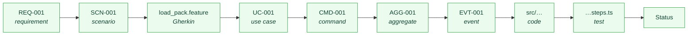
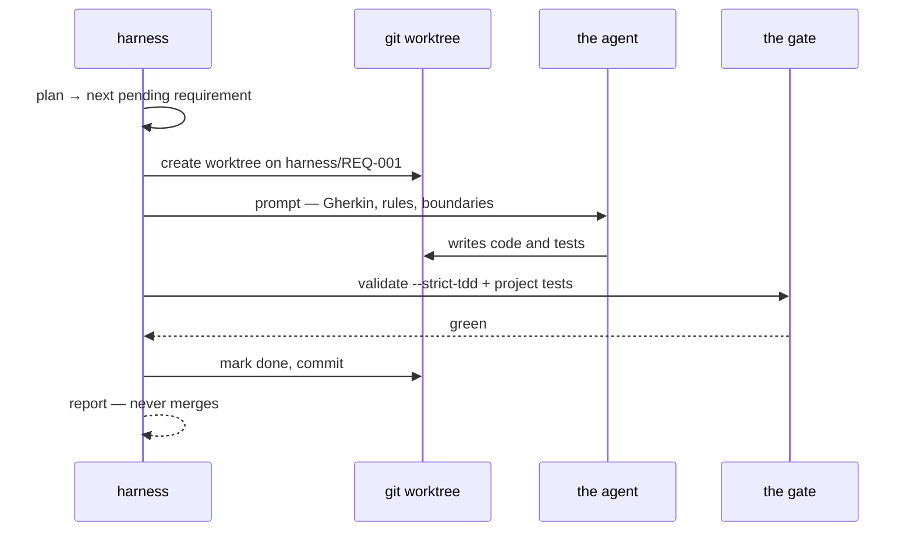

<!-- csda:allow-placeholders — the article quotes the {{VAR}} template syntax. -->
<!--
  FOR PUBLICATION ON MEDIUM.

  Medium does not render Mermaid. Two options per diagram:
    1. Paste the fenced block into https://mermaid.live, export PNG, upload.
    2. Push this file to GitHub — it renders Mermaid natively — and embed the
       GitHub URL in Medium, which unfurls it.

  Suggested tags: ai-agents, spec-driven-development, software-testing,
  developer-tools, domain-driven-design
-->

# The Gate That Approved Work It Never Checked

## We spent months building a pipeline so an AI agent could write code from our specifications. The first time we ran it, it worked. That turned out to be the problem.

I want to tell you about the ten minutes that changed how I think about agentic
coding, and the fifteen commits that came out of them.

But first you need to know what we had built, because the whole story turns on
one design decision we got wrong.

---

## The bet

Everyone has noticed the same thing this year: an agent can write a thousand
lines before you finish reading the ticket. The scarce resource stopped being
typing and became **saying precisely what you want**.

The obvious response is "write better specifications". That is not a plan. Here
is why, in one example.

A requirement in your repository says the system rejects expired tokens. It
stopped doing that in March. Nobody noticed, because nothing was watching — the
document has no referents, so there is nothing to check it against.

For years that was survivable. A developer reading it would frown, ask someone,
and learn the truth in ninety seconds. Documents were hints, and we are good at
discounting hints.

**An agent does not frown.** It reads the stale requirement as ground truth,
builds three features on top of it, and writes tests that assert the wrong
behaviour convincingly. You have not automated engineering. You have automated
the propagation of stale documentation, at machine speed, with a plausible
commit message attached.

So our bet was: a specification has to stop being a document and become a
**model** — one where every claim has somewhere to be checked against.

Concretely, three practices most of us already believe in, wired together so
that continuous integration can verify them link by link.

From **Domain-Driven Design**, the vocabulary: bounded contexts, aggregates,
commands and queries, domain events, use cases with actors. Not as prose —
as records with identifiers that reference each other. From **BDD**, a Gherkin
scenario per requirement, which is the executable half. From **TDD**, the rule
that a requirement may not claim to be built without naming the test that
proves it.

The join is a ten-column traceability matrix, one row per requirement:



Read left to right, a row is a sentence: *this requirement is demonstrated by
this scenario, in this feature file, realised by this use case, which dispatches
this command against this aggregate, emitting this event, implemented here,
proven by this test, currently in this state.*

Break a link and the build fails. That is the point. **A specification cannot
quietly become false, because the moment it does, CI goes red.**

The tooling around that grew for months. A linter that resolves the references —
an event emitted by an aggregate nobody declared is a build failure, the same
way an undefined symbol is. Domain packs, so `auth` requirements are installed
and version-pinned like a library rather than copy-pasted into eleven services.
A gate command, `validate --strict-tdd`. And finally a harness: point it at a
requirement, it creates a git worktree, hands your agent a prompt, runs the
gate, and commits on green.

Vendor-neutral by construction — the agent is any shell command containing a
`{prompt_file}` placeholder — and it never merges. It leaves a branch for a
human.

Then we ran it.

---

## Run one: it worked, and that was the problem

We pointed it at a real project: a spec viewer, fifteen requirements, all
supplied by a domain pack. Claude as the agent. First requirement: load a
`pack.yaml` from disk and show its contents.



Attempt one timed out. Attempt two passed.

I opened the branch expecting to be disappointed and was not. Eighteen files,
laid out across the hexagonal boundaries the rules demanded — domain logic with
no framework imports, a port, an adapter, the React component at the edge. Step
definitions written. Its scenario passed. It had not touched the feature files
or the specs, which was the one boundary that would have invalidated the whole
exercise.

I was, briefly, delighted.

Then I checked whether the gate had actually verified any of that.

It had not.

Two ordinary decisions had combined into a hole. The gate ran the project's
build and unit tests, and it ran `validate --strict-tdd`. But strict-TDD only
demands a test once a requirement moves past `Draft` — and the requirement was
still `Draft` at that moment, because the harness marks it done *after* the
gate. Meanwhile the test command was a fixed string with no way to say "run the
scenario belonging to the requirement you are currently gating".

So the loop could take a requirement, watch an agent produce anything at all,
and mark it **Implemented with its scenario never executed**.

The work was good because the agent was good. Nothing had checked. And that is
strictly worse than a failure, because it would have reported success just as
confidently on garbage — which is the exact failure the entire tool exists to
prevent, reproduced inside the tool.

I sat with that one for a while.

---

## Run two: the gate rejected correct work

Fix in hand — the gate command now substitutes `{feature_file}`, so it runs the
scenario under test and only that one — I moved to the second requirement:
surface a clear error when a pack file is malformed.

It failed both attempts.

The agent's code was right. I ran its scenario by hand and it passed. The gate
had run the **entire** suite instead of one scenario, and thirteen unimplemented
scenarios failed with it.

The cause was a single configuration key. Cucumber lets you pin `paths` in its
config file, and a config `paths` silently overrides the path you pass on the
command line. I had fixed that on `main`; the run was stacked on a branch cut
before the fix, and a branch carries its own configuration.

That is correct git behaviour and an expensive trap. But the part that cost me
real time was different:

**Diagnosing it required a second full agent run.** A failed run deleted the
worktree and committed nothing, so the branch came back byte-identical to its
base. The report said `Gate failed at: test command` and stopped. Fifteen
minutes of agent time to recover information the first run had already had and
thrown away.

Two more defects, then. A failing gate has to say **which command it ran** — a
gate that silently does the wrong thing fails identically to a real failure. And
a failed attempt has to be **committed**, not deleted, so there is something to
read.

---

## Run three: the account ran out of money

By the third run the fixes were in. It failed again, for a reason I had not
planned to test:

```
❌ REQ-002  fail (2 attempts)  → harness/REQ-002
     Agent exited 1.
     │ You've hit your monthly spend limit · raise it at claude.ai/settings/usage
     └ full output: --format json · reproduce: --keep-worktrees
     ↳ the attempt is committed on harness/REQ-002 — review it
```

It was the best possible test.

Before the fixes that would have printed `Agent exited 1`, and 861 lines of
perfectly good work would have gone into the bin with the worktree. Instead the
cause is on screen and the work is on a branch.

---

## The tally

Three runs. Ten defects, all of them in our machinery rather than the agent's.

The gate that approved without verifying. The gate that rejected correct work
and could not say why. A harness that **blocked its own second run**, because it
archived prompts into the project directory and then refused to start on a dirty
tree. A test that had been quietly *weakened* to accommodate that, filtering the
offending directory out of its own clean-tree assertion in order to pass — which
is how the mess had stayed invisible. A report holding the full failure output
and printing only its first line. A default timeout both runs disproved.

Not one of them was visible by reading the code. I know, because I had read the
code. Several of them I had written myself, with tests, in the weeks before.

---

## What I actually believe now

**Running it once is worth more than a month of design.** That is not a platitude
about testing; it is specific. These were not edge cases. They were two ordinary
decisions meeting in the middle, and the only instrument that detects that is
execution.

**The strategic writing on this topic ends one step too early.** There is a lot
of it, and it is good — the case that specs become the human/agent interface is
made and I agree with it. But it ends at the architecture. Nobody writes down
what happens on Tuesday when you run the thing, and Tuesday is where the
information is.

**"Eventually agents write all the code, humans review specs" is directionally
right and currently unearned.** If you remove the human from authoring, the gate
becomes the only thing between an agent's output and your main branch. We
discovered by running it that ours approved work it had not verified. So the
sequencing is the reverse of how it is usually pitched:

> You do not earn the right to remove human authorship by adopting specs. You
> earn it by demonstrating your gate can tell good work from bad — and the only
> way to demonstrate that is to run it, repeatedly, and count how often it is
> wrong in each direction.

We now instrument exactly that. It is the metric that mattered, and the one we
did not have on the day it would have saved us.

**Scenario quality stopped being a style preference.** Every team accumulates
these:

```gherkin
Scenario: Test login
  Given the system is ready
  When something happens
  Then it works
```

That used to be a smell. With an agent reading it, it is a defect: a human asks
a colleague what "it works" means, and an agent picks an interpretation,
implements it confidently, and turns the scenario green. So generic titles,
missing `When`, missing `Then` and vague steps are now lint rules that fail the
build under `--strict`.

---

## If you want to poke at it

It is MIT-licensed and on npm. The honest framing: one dogfood project and one
pilot, nobody outside our own repositories has used it in anger, and everything
above is what we measured on our own work.

```bash
npx create-spec-driven-app@latest onboard   # reads your repo, proposes capabilities, writes nothing
npx create-spec-driven-app@latest adopt     # writes the spec skeleton, touches no source
npx create-spec-driven-app@latest validate . --strict-tdd
```

Start at the gate, not at the agent. A pull-request check that fails when a
requirement loses its test is worth more than any amount of orchestration on top
of specifications nobody trusts yet. Most teams should stop there for a while.

And whichever tool you are evaluating, including this one, the question I would
ask is not what the specification format looks like.

**It is: has anyone run the loop, and what broke?**

If the answer is nothing, they have not run it.
