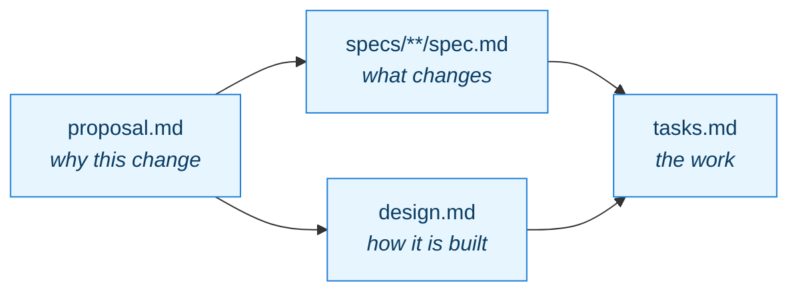
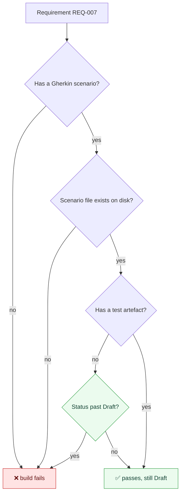
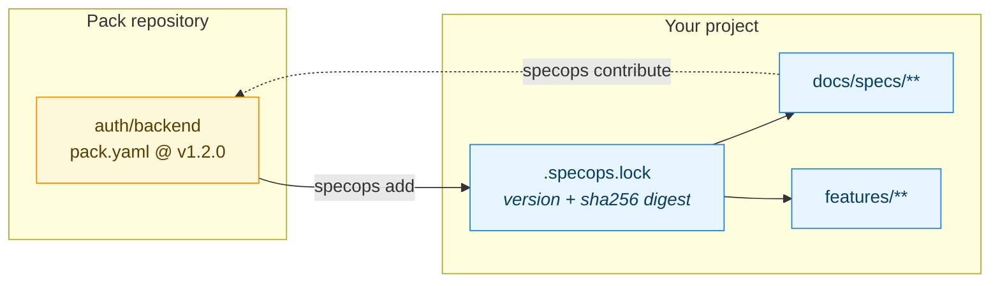
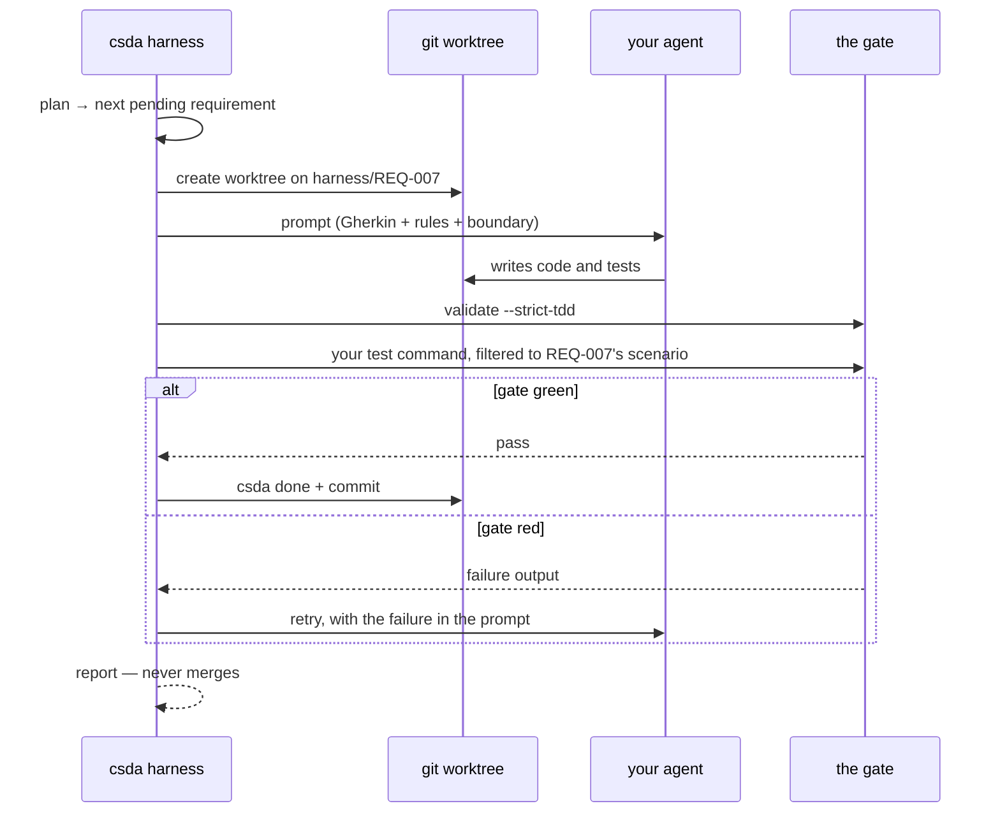
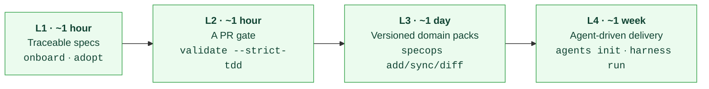

<!-- csda:allow-placeholders — the article quotes the {{VAR}} template syntax. -->
<!--
  FOR PUBLICATION ON MEDIUM.

  Medium does not render Mermaid. Two options for each diagram below:
    1. Paste the fenced block into https://mermaid.live, export PNG, upload.
    2. Push this file to GitHub — it renders Mermaid natively — and embed the
       GitHub URL in Medium, which unfurls it.

  Suggested tags: spec-driven-development, ai-agents, software-architecture,
  developer-tools, engineering-management
-->

# Specs That Cannot Lie

## We built the spec-driven pipeline everyone is describing. Then we ran it, and it told us something uncomfortable.

There is broad agreement now that the bottleneck in software has moved. When an
agent can produce a thousand lines in ten minutes, the scarce resource stops
being typing speed and becomes **the ability to say precisely what you want**.
InfoQ [made this case well for enterprises](https://www.infoq.com/articles/enterprise-spec-driven-development/):
specifications become the interface between humans and agents, and the
organisations that treat that as a cultural change rather than a tool rollout
will pull ahead.

I agree with all of it. It is also, as written, entirely theory.

What that article does not contain — what almost none of the writing on
spec-driven development contains — is an account of what happens when you
actually run the loop. We built the pipeline. We pointed a real agent at it.
Within three runs it produced **ten defects in our own machinery**, and one of
them invalidated the premise of the whole product.

This is that account, and the design decisions that came out of it.

---

## The failure mode nobody writes about

Spec-driven development has an obvious failure mode, and it is not that people
refuse to write specs. It is that **specifications drift into fiction**.

A requirement says the system does X. The code stopped doing X two sprints ago.
The document is still there, still confident, still wrong — and now an agent
reads it as ground truth and builds on a lie. You have not automated
engineering. You have automated the propagation of stale documentation at
machine speed.

Every design decision below exists to make that specific failure impossible, or
at least loud.

---

## Decision 1: model dependencies, not phases

The natural way to structure spec-driven work is as phases: discover, then
design, then tasks. It reads well on a slide. It is also how spec-driven
development earns its reputation for ceremony, because the moment you enforce
phases you are telling a team it may not write down an obvious task until a
document upstream is blessed.

So the artefacts form a **dependency graph**, and dependencies are enablers
rather than gates.



You can write `tasks.md` before `design.md`. The tool will tell you what writing
each artefact unblocks, and what is still missing, but it will not stop you. The
graph is also **configurable** — a team that works BDD-first inserts a `feature`
artefact before `specs`, and the tool follows their shape rather than ours.

The difference sounds academic until you watch a team hit a phase gate at 4pm on
a Thursday and simply route around the tool. A rule that does not survive contact
with real work gets satisfied with fiction.

---

## Decision 2: the matrix is the gate

Every requirement occupies one row in a ten-column traceability matrix:

| Requirement | Scenario ID | Feature file | Use Case | Command/Query | Aggregate | Event | Technical artifact | Test artifact | Status |
|---|---|---|---|---|---|---|---|---|---|

That table is not documentation. **It is a build gate.**



`csda validate --strict-tdd` fails your pull request when a requirement has no
scenario, when the scenario file it names does not exist, or when a requirement
has moved past `Draft` without a test. A guard test additionally asserts that
every path named in the matrix resolves on disk.

This is the piece that makes drift expensive instead of invisible. A spec cannot
quietly become false, because the moment it does, CI goes red.

It is also, incidentally, the gap the InfoQ piece names as unsolved in current
tooling — *"undefined specification-to-implementation alignment validation"*.
It is solvable. It just has to be a gate rather than a document.

---

## Decision 3: domain knowledge is a versioned dependency

Enterprises do not have one authentication requirement. They have the same
authentication requirements in eleven services, subtly diverging.

So domain knowledge ships as a **pack**: a versioned, schema-validated bundle of
requirements, use cases, aggregates, events and Gherkin scenarios, installed the
way you install a library.



Three properties matter here.

**It is pinned by content, not by label.** The lockfile records a `sha256` over
the pack's file tree. Re-installing the same version with different content
fails loudly — that is what a moved tag, a rewritten history or a poisoned cache
looks like, and a version number is a label rather than a promise.

**Upgrades are reviewed as intent.** `specops diff --as-change` renders a version
bump as a proposal describing what requirements moved, instead of a file diff
nobody reads.

**Learning flows back.** `specops contribute` sends a local change upstream to
the pack, so what one team discovers becomes context for every other team. This
is the InfoQ article's "each gap strengthens the harness", implemented as a
command rather than described as a virtue.

---

## Decision 4: the loop, and the fact that it never merges

At the top adoption level an agent drives the work. One requirement at a time,
each in its own git worktree:



Two things are deliberate.

**The agent is any shell command.** `claude -p`, `aider --message-file`,
`opencode run` — the harness only requires that your command contain a
`{prompt_file}` placeholder. No vendor is baked in.

**It never merges.** It leaves branches. A human reviews and merges, always.

---

## What happened when we ran it

Here is the part I have not seen written down anywhere else.

We pointed the loop at a real greenfield project — a spec viewer, fifteen
requirements, specs supplied by a domain pack — with Claude as the agent. Three
runs. Every finding below is a defect in **our** machinery, not the agent's.

### Run 1: it worked, and that was luck

The agent produced eighteen files across the correct hexagonal layers, wrote the
step definitions, and its scenario passed. It did not touch the feature files or
the specs, which is the boundary that would have voided the exercise.

Then I checked whether the gate had actually verified any of that.

It had not. The gate ran the project's build and unit tests, and it ran
`validate --strict-tdd` — but the requirement was still `Draft` at that moment,
so strict-TDD did not demand its test, and the test command had no way to target
the scenario under test. **The loop could mark a requirement "Implemented" with
its scenario never executed.**

The work was good because the agent was good. Nothing checked. That is worse
than a failure, because it would have reported success just as confidently on
bad work.

### Run 2: the gate rejected correct work

Second requirement. Failed both attempts.

The agent's code was right — the scenario passed when run by hand. The gate had
run the *entire* suite instead of one scenario, because a configuration key in
the base branch silently overrode the filter, and thirteen unimplemented
scenarios failed. **A misconfigured gate fails identically to a real failure.**

Worse: diagnosing it took a second full agent run, because a failed run deleted
the worktree and committed nothing. The branch came back byte-identical to its
base. Fifteen minutes of agent time spent recovering information the first run
already had and threw away.

### Run 3: the account hit its spend limit

Which turned out to be the best possible test, because by then the fixes were
in:

```
❌ REQ-002  fail (2 attempts)  → harness/REQ-002
     Agent exited 1.
     │ You've hit your monthly spend limit · raise it at claude.ai/settings/usage
     └ full output: --format json · reproduce: --keep-worktrees
     ↳ the attempt is committed on harness/REQ-002 — review it
```

Before the fixes: `Agent exited 1`, and 861 lines of the agent's work deleted
along with the worktree.

### The tally

Ten defects, from three runs. The gate that approved without verifying. The
harness that blocked its own second run by leaving untracked files in the
project. A test that had been *weakened* to accommodate that, filtering the
offending directory out of its own clean-tree assertion in order to pass. A
report that captured the full failure output and then printed only its first
line. A default timeout that both real runs disproved.

None of them was visible by reading the code. Every one would have shipped.

---

## What this means for the "agents write all the code" idea

The strategic writing on spec-driven development tends to end at the same place:
eventually humans stop authoring code and only review specs.

I think that is directionally right and currently unsupported, and our own data
is the reason.

If you remove the human from writing, the gate becomes the only thing standing
between an agent's output and your main branch. We discovered — by running it,
not by reasoning about it — that **our gate approved work it had not verified**.
Not through a subtle bug. Through two ordinary design oversights that combined.

So the honest sequencing is the reverse of how it is usually presented:

> You do not earn the right to remove human authorship by adopting specs. You
> earn it by demonstrating that your gate can tell good work from bad — and the
> only way to demonstrate that is to run it, repeatedly, and count how often it
> is wrong in each direction.

We now instrument exactly that: how often the gate fails real work, and how often
it passes work it should not have. It is the metric that mattered and the one we
did not have.

---

## Adopting it without a big bang

Each level is useful alone and requires nothing above it.



Brownfield is the expected case, not the exception. `csda onboard` reads an
existing repository and *proposes* the capabilities its layout already implies,
with the evidence for each, and writes nothing. `csda adopt` then installs the
spec skeleton without touching a line of source.

Most teams should stop at L2 and stay there for a while. A PR gate that fails
when a requirement loses its test is worth more than any amount of agent
orchestration on top of specs nobody trusts.

---

## Where it does not work yet

Three things, stated plainly.

**Multi-repository orchestration does not exist.** One specification cannot
decompose into work across several repositories. The unit is the project. For
now the issue tracker is the cross-repo identifier — `csda alm sync` keeps Jira
and Azure Boards in step — which is less elegant and much cheaper than the
alternative.

**Specs live in git, and that creates friction for non-developers.** This is the
sharpest criticism in the InfoQ piece and it lands. Our answer is not to move
specs out of git — git is what lets CI verify anything — but to publish
read-only surfaces for people who will never open a pull request.

**One dogfood project and one pilot is not a sample.** Nobody outside our own
repositories has used this in anger. Everything above is what we measured on our
own work, and I would not present it as more than that.

---

## The uncomfortable conclusion

The industry writing about spec-driven development is mostly strategy. It is
good strategy. But strategy has a way of describing the destination while
skipping the part where you discover your instruments were lying to you.

We built the pipeline. Running it three times found ten defects, including a gate
that approved work without checking it — which, had we shipped confidently
instead of running it, would have been a tool that automated the exact failure it
was designed to prevent.

If you are evaluating any of these tools, including ours, the question worth
asking is not what the specification format looks like. It is:

**Has anyone run the loop, and what broke?**

If the answer is no, the format does not matter yet.

---

*The tool is `create-spec-driven-app`, MIT-licensed and on npm. v0.6.0 at the
time of writing: 687 tests, 11 curated domain packs, 20 architecture decision
records, published with SLSA provenance and a multi-arch container image.*

```bash
npx create-spec-driven-app@latest onboard   # reads your repo, proposes capabilities
npx create-spec-driven-app@latest adopt     # writes the skeleton, touches no code
npx create-spec-driven-app@latest validate . --strict-tdd
```
