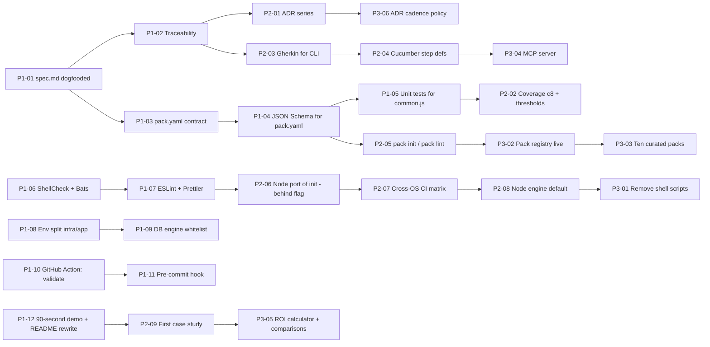

# Implementation Roadmap — Step-by-Step Plan by Phases

> Consolidates the two improvement backlogs into one executable plan:
> the tactical engineering items from
> [`/IMPROVEMENTS.md`](../IMPROVEMENTS.md) (SDD / DDD / BDD / TDD) and
> the strategic risk responses from
> [`./risk-mitigation-plan.md`](./risk-mitigation-plan.md) (R1–R4).
>
> Each step is numbered, dependency-aware, and bound to concrete files,
> commands and acceptance criteria so any contributor — human or AI
> agent — can pick it up without further design work.

---

## 0. How to Use This Document

1. Steps are grouped into **three phases** matching the strategic plan
   (0–90, 90–180, 180–365 days).
2. Every step has a stable identifier of the form **`P{phase}-{n}`**
   (e.g. `P1-04`). The numbering is referenced by the traceability
   tables and by future PRs.
3. The **Source** field links each step back to its origin in either
   `IMPROVEMENTS.md` (e.g. `IMP 2.1`) or `risk-mitigation-plan.md`
   (e.g. `RISK R1`). Cross-references are deliberate: many tactical
   items materialise a strategic axis.
4. **Dependencies** are listed as a list of preceding step IDs. A step
   never starts until all of its dependencies are complete.
5. Each phase ends with an **Exit Gate**. The gate must pass before
   work on the next phase begins.

### 0.1 Mapping of source documents

| Source document                       | Abstraction level    | Phase mapping       |
| ------------------------------------- | -------------------- | ------------------- |
| `/IMPROVEMENTS.md`                    | Tactical, file-level | Items by `P0/P1/P2` |
| `/mejoras/risk-mitigation-plan.md`    | Strategic, ecosystem | Items by `R1–R4`    |
| **This document**                     | Operational, ordered | Phases 1–3          |

### 0.2 Conventions

- **Effort** is expressed in person-days (PD), counted at the level of
  a single senior engineer.
- **Owner** roles: `LEAD` (tech lead / maintainer), `DX` (build /
  developer-experience engineer), `DA` (developer advocate / tech
  writer), `DSG` (designer).
- All commands assume the repository root is the current working
  directory unless otherwise stated.

---

## 1. Critical Path Overview

---

## 2. Phase 1 — Foundations (0–90 days)

**Theme.** Make `validate` ambient, give `pack.yaml` an editor-grade
contract, dogfood specifications, and ship a credible demo. Investment:
**1.5 FTE × 3 months**.

### 2.1 Phase 1 goals

- The CLI carries its own `spec.md` and traceability matrix.
- `pack.yaml` has a published JSON Schema with editor autocompletion.
- A reusable GitHub Action runs `validate` on every PR.
- A Node-based implementation of `init` exists behind a feature flag
  with parity tests against the shell version.
- A 90-second demo video and a rewritten README are live.

### 2.2 Steps

---

#### **P1-01 — Dogfood `spec.md` for the CLI**

- **Source:** IMP 2.1 (P0)
- **Owner:** LEAD
- **Effort:** 1 PD
- **Dependencies:** —

**Goal.** Author the CLI's own product specification.

**Actions.**
1. Copy `templates/base/spec.md.tpl` to `/spec.md`.
2. Fill it in for the CLI itself: vision, personas (engineers, AI
   agents, auditors), success criteria, non-goals, risks.
3. Cross-link to `/PROJECT_REPORT.md` and `/IMPROVEMENTS.md`.

**Acceptance.** `/spec.md` exists, references all four disciplines,
and is linked from the README.

---

#### **P1-02 — CLI traceability matrix**

- **Source:** IMP 2.2 (P0)
- **Owner:** LEAD
- **Effort:** 2 PD
- **Dependencies:** P1-01

**Goal.** Map every CLI requirement to a test and a source file.

**Actions.**
1. Create `docs/specs/traceability.md` with one row per public command
   (`init`, `validate`, `expand`, `--help`, `--version`).
2. Link each row to the test in `tests/cli.test.js` and to the
   implementing script.
3. Add a CI check (`scripts/check_traceability.js`) that fails when a
   requirement ID appears in `spec.md` but not in the matrix.

**Acceptance.** `npm test` passes and the new CI check is wired in
`.github/workflows/ci.yml`.

---

#### **P1-03 — `pack.yaml` contract specification**

- **Source:** IMP 2.6 (P0)
- **Owner:** LEAD
- **Effort:** 2 PD
- **Dependencies:** —

**Goal.** Make the domain-pack format explicit and authoritative.

**Actions.**
1. Author `docs/specs/domain-pack-format.md`: every key, cardinality,
   allowed values, examples drawn from `tests/fixtures/domain-packs/parking-management`.
2. State the version policy (SemVer on `schemaVersion`).
3. Reference it from `README.md` and `AI_RULES.md.tpl`.

**Acceptance.** The fixture validates against the spec by inspection;
every key in the fixture is documented.

---

#### **P1-04 — JSON Schema for `pack.yaml`**

- **Source:** RISK R2.1, IMP 5.3 (P0)
- **Owner:** DX
- **Effort:** 3 PD
- **Dependencies:** P1-03

**Goal.** Editors auto-complete `pack.yaml`; the CLI rejects malformed
files early.

**Actions.**
1. Create `schemas/pack.schema.json` (draft 2020-12) with `$id`
   `https://spec-driven.dev/schemas/pack/v1.json`.
2. Add `# yaml-language-server: $schema=…` headers to every fixture
   and template.
3. Plug `ajv` into `scripts/expand_domain_pack.js`; fail with a
   structured error on schema violations.
4. Add negative tests in `tests/unit/pack-schema.test.js`.

**Acceptance.** Editors with the YAML LSP show completions; CI runs
positive and negative schema tests.

---

#### **P1-05 — Unit tests for `scripts/domain-pack/common.js`**

- **Source:** IMP 5.1 (P0)
- **Owner:** DX
- **Effort:** 3 PD
- **Dependencies:** P1-04

**Goal.** Bring the JS helpers under test in isolation.

**Actions.**
1. Create `tests/unit/common.test.js` using `node:test`.
2. Cover: YAML parsing (happy paths, missing keys, special
   characters), template rendering (escaping, idempotency),
   error formatting.
3. Aim for ≥ 90 % line coverage of `common.js`.

**Acceptance.** `npm test` runs unit tests separately from E2E
(`npm run test:unit`).

---

#### **P1-06 — ShellCheck and Bats for shell scripts**

- **Source:** IMP 5.2, RISK R3 (P0)
- **Owner:** DX
- **Effort:** 3 PD
- **Dependencies:** —

**Goal.** Stop bleeding from shell-script fragility while the Node
port is in flight.

**Actions.**
1. Add ShellCheck to CI; fix every existing warning.
2. Add Bats-core under `tests/shell/`; cover required-field validation,
   default values, `--force`, `--dry-run`, `--no-git` in
   `new_spec_project.sh`.
3. Add `tests/shell/validate_specs.bats` for `validate_specs.sh`.

**Acceptance.** `.github/workflows/ci.yml` runs Bats and ShellCheck;
both are green on `main`.

---

#### **P1-07 — ESLint + Prettier**

- **Source:** RISK R3 (P1)
- **Owner:** DX
- **Effort:** 1 PD
- **Dependencies:** —

**Goal.** Codify JS style across `bin/`, `scripts/`, `tests/`.

**Actions.**
1. Add `eslint.config.js` (flat config) and `.prettierrc`.
2. Run `npx eslint --fix` once; commit the diff.
3. Add `npm run lint` and `npm run format`; wire into CI.

**Acceptance.** CI fails on ESLint errors; pre-existing files conform.

---

#### **P1-08 — Split infrastructure and application env vars**

- **Source:** RISK R3 / Cross-cutting 6.1 (P1)
- **Owner:** DX
- **Effort:** 2 PD
- **Dependencies:** —

**Goal.** Remove the conceptual overlap between Compose vars
(`POSTGRES_*`) and app vars (`DATABASE_URL`).

**Actions.**
1. Split each `.env.<env>.tpl` into `.env.<env>.infra.tpl` and
   `.env.<env>.app.tpl`.
2. Update `docker-compose.yml.tpl` to load only `*.infra` for the `db`
   service.
3. Update the generated `README.md.tpl` and
   `docs/specs/runtime-environments.md.tpl`.
4. Add a Bats test (`tests/shell/env_split.bats`) for the split.

**Acceptance.** `npm test` passes; generated projects start with the
new layout.

---

#### **P1-09 — Whitelist enforcement for DB engine**

- **Source:** Cross-cutting 6.1 (P0)
- **Owner:** DX
- **Effort:** 0.5 PD
- **Dependencies:** P1-06

**Goal.** Reject unsupported `DATABASE_ENGINE` values with a clear
error.

**Actions.**
1. Add an explicit whitelist (`postgres` for now) to
   `new_spec_project.sh` and the future Node implementation.
2. Add a Bats test asserting the error message.

**Acceptance.** Invalid engine produces a non-zero exit and a
human-readable hint.

---

#### **P1-10 — GitHub Action: `validate` on PR**

- **Source:** RISK R1.1 (P0)
- **Owner:** DX
- **Effort:** 3 PD
- **Dependencies:** P1-02

**Goal.** Make `validate` ambient on every pull request.

**Actions.**
1. Create a reusable composite action under
   `actions/spec-driven-action/action.yml` that runs `validate` and
   summarises the traceability delta as a PR comment.
2. Add `templates/base/.github/workflows/specs.yml.tpl` so generated
   projects ship with the action enabled.
3. Document configuration in `README.md` and the docs site.

**Acceptance.** A reference downstream project shows a green check
and a traceability-delta comment on its PRs.

---

#### **P1-11 — Pre-commit hook**

- **Source:** RISK R1 (P0)
- **Owner:** DX
- **Effort:** 1 PD
- **Dependencies:** P1-10

**Goal.** Give contributors immediate feedback before push.

**Actions.**
1. Add `templates/base/.pre-commit-config.yaml.tpl` with a hook id
   `validate-specs` invoking the CLI.
2. Reference the hook in the generated README.

**Acceptance.** `pre-commit run --all-files` succeeds on a freshly
generated project.

---

#### **P1-12 — 90-second demo and README rewrite**

- **Source:** RISK R4 (P0)
- **Owner:** DA + DSG
- **Effort:** 5 PD
- **Dependencies:** P1-10

**Goal.** Replace the conceptual pitch with a single, observable
demonstration.

**Actions.**
1. Record `docs/assets/demo.mp4`: `init` → spec review → `expand` →
   AI-agent implementation → `validate` passes.
2. Restructure `README.md` around one promise, one demo, three bullet
   benefits, one CTA.
3. Add a one-screen Quickstart (≤ 10 lines) at the top.

**Acceptance.** Median time-to-first-success measured in three user
interviews ≤ 5 minutes.

### 2.3 Phase 1 Exit Gate

- All P0 items in `IMPROVEMENTS.md` are closed.
- JSON Schema is published; a reference downstream project consumes
  it.
- The GitHub Action is available on the GitHub Marketplace.
- The Node implementation of `init` is feature-flagged and passes
  parity tests against the shell version.
- The demo video is live and the README rewrite is merged.

If any of the above is missing at day 90, the team **extends Phase 1
by up to 30 days** before starting Phase 2.

---

## 3. Phase 2 — Defaults and Coverage (90–180 days)

**Theme.** Flip defaults: the Node engine becomes the standard; BDD
coverage of the CLI lands; the first case study goes public.
Investment: **2 FTE × 3 months**.

### 3.1 Phase 2 goals

- Node engine is the default; shell scripts kept as a one-release
  compatibility shim.
- Gherkin scenarios cover `init`, `validate`, `expand` and the runtime
  contract; Cucumber runs in CI.
- Coverage reporting via `c8` enforces ≥ 80 % lines / ≥ 70 % branches.
- VS Code extension MVP is published.
- First public case study and a comparison matrix are live.

### 3.2 Steps

---

#### **P2-01 — ADR series for foundational decisions**

- **Source:** IMP 2.3 (P1)
- **Owner:** LEAD
- **Effort:** 3 PD
- **Dependencies:** P1-02

**Goal.** Capture five non-obvious decisions made so far.

**Actions.**
1. ADR-0001: choice of `node:test` over Jest.
2. ADR-0002: shell for `init` (until P2-07 supersedes it).
3. ADR-0003: JS for `expand`.
4. ADR-0004: YAML for `pack.yaml`.
5. ADR-0005: multi-environment `.env.*` strategy.

**Acceptance.** Five ADRs in `docs/specs/adr/`, each linked from the
traceability matrix.

---

#### **P2-02 — Coverage reporting and thresholds**

- **Source:** IMP 5.4 (P1)
- **Owner:** DX
- **Effort:** 1 PD
- **Dependencies:** P1-05

**Goal.** Make regressions visible.

**Actions.**
1. Add `c8` as a dev dependency; configure thresholds (80 % lines / 70 %
   branches) in `package.json`.
2. Publish the HTML report as a CI artefact.

**Acceptance.** CI fails when coverage regresses below the
thresholds.

---

#### **P2-03 — Gherkin scenarios for CLI commands**

- **Source:** IMP 4.1 (P0)
- **Owner:** LEAD + DA
- **Effort:** 3 PD
- **Dependencies:** P1-02

**Goal.** Express CLI behaviour as executable acceptance criteria.

**Actions.**
1. Author `features/cli/init.feature`, `validate.feature`,
   `expand.feature` covering happy paths, `--dry-run`, `--force`,
   unknown commands, malformed configs.
2. Cross-reference scenario IDs in `docs/specs/traceability.md`.

**Acceptance.** Each public command has ≥ 3 scenarios.

---

#### **P2-04 — Cucumber step definitions and runner**

- **Source:** IMP 4.2, RISK R1 (P0)
- **Owner:** DX
- **Effort:** 4 PD
- **Dependencies:** P2-03

**Goal.** Run the Gherkin scenarios in CI.

**Actions.**
1. Add `@cucumber/cucumber` as a dev dependency.
2. Implement steps under `features/cli/steps/*.js` that drive the
   built CLI as a subprocess.
3. Add `npm run test:bdd` and wire it into CI.

**Acceptance.** All scenarios pass on `main` and on the matrix from
P2-07.

---

#### **P2-05 — `pack init` and `pack lint`**

- **Source:** RISK R2.1 (P1)
- **Owner:** DX
- **Effort:** 5 PD
- **Dependencies:** P1-04

**Goal.** Make authoring a pack take minutes, not hours.

**Actions.**
1. `scripts/init_pack.js`: interactive prompts driven by the JSON
   Schema; produces a valid `pack.yaml`.
2. `scripts/lint_pack.js`: semantic checks beyond the schema
   (orphan refs, duplicate IDs, missing scenarios).
3. Add corresponding subcommands to `bin/create-spec-driven-app.js`.

**Acceptance.** A blank checkout reaches a passing `pack lint` in
≤ 30 minutes.

---

#### **P2-06 — Node port of `init` behind `--engine=node`**

- **Source:** RISK R3 (P1)
- **Owner:** LEAD
- **Effort:** 8 PD
- **Dependencies:** P1-07, P1-08, P1-09

**Goal.** Eliminate the Bash + sed substrate.

**Actions.**
1. Create `scripts/init_project.js` using `eta` (or `handlebars`) for
   templating.
2. Keep CLI flags identical to the shell version.
3. Add `--engine=node|shell` (default `shell` for now).
4. Add a parity test that runs both engines against the example config
   and asserts byte-identical output.

**Acceptance.** Parity test green on Linux and macOS.

---

#### **P2-07 — Cross-OS CI matrix**

- **Source:** RISK R3 (P1)
- **Owner:** DX
- **Effort:** 2 PD
- **Dependencies:** P2-06

**Goal.** Guarantee identical behaviour on Linux, macOS and Windows.

**Actions.**
1. Update `.github/workflows/ci.yml` with a matrix
   `{ubuntu-latest, macos-latest, windows-latest}` × `{node 18, 20, 22}`.
2. Add `.gitattributes` with `text=auto eol=lf` to keep generated
   files normalised.
3. Add a snapshot determinism test (`tests/snapshot/init-determinism.test.js`).

**Acceptance.** All matrix jobs green on `main`.

---

#### **P2-08 — Flip the default engine to Node**

- **Source:** RISK R3 (P1)
- **Owner:** LEAD
- **Effort:** 1 PD
- **Dependencies:** P2-07

**Goal.** Make Node the default; shell becomes opt-in for one release.

**Actions.**
1. Change the default of `--engine` to `node`.
2. Document the migration and the timeline for shell removal in
   `CHANGELOG.md`.
3. Print a deprecation warning when `--engine=shell` is selected.

**Acceptance.** A clean checkout uses Node by default; the
deprecation warning is visible.

---

#### **P2-09 — First public case study**

- **Source:** RISK R4 (P1)
- **Owner:** DA
- **Effort:** 5 PD
- **Dependencies:** P1-12

**Goal.** Replace the conceptual pitch with one concrete success
story.

**Actions.**
1. Recruit a real (or anonymised) team that adopted the CLI.
2. Write `docs/case-studies/case-1.md` (≈ 1 500 words) with
   before/after metrics.
3. Surface it on the docs landing page.

**Acceptance.** The case study is live and referenced from the
README.

---

#### **P2-10 — VS Code extension MVP**

- **Source:** RISK R1.1 (P1)
- **Owner:** DX
- **Effort:** 8 PD
- **Dependencies:** P1-04, P1-10

**Goal.** Surface `validate` inline; navigate the traceability matrix.

**Actions.**
1. Bootstrap a new repo `vscode-spec-driven`.
2. Validate `pack.yaml` against the JSON Schema with squigglies.
3. Run `validate` on save; display diagnostics.
4. Provide a "Reveal in traceability matrix" command on requirement
   IDs.

**Acceptance.** Extension is published to the VS Code Marketplace and
hits 100 installs.

### 3.3 Phase 2 Exit Gate

- Node engine is the default; CI is green on all three OSes.
- Cucumber suite is part of CI with ≥ 15 scenarios across CLI and
  runtime features.
- Coverage thresholds are enforced.
- One case study is published; the comparison matrix is live.
- VS Code extension is available on the Marketplace.

---

## 4. Phase 3 — Ecosystem and Maturity (180–365 days)

**Theme.** Turn the tool into infrastructure. Ecosystem effects
materialise: a public pack registry, an MCP server, removal of the
shell legacy. Investment: **2.5 FTE × 6 months**.

### 4.1 Phase 3 goals

- Public pack registry live with ≥ 10 curated packs.
- MCP server published so any MCP-aware agent integrates natively.
- Shell scripts removed; CLI is pure Node.
- Three case studies, ROI calculator and comparison matrix live.
- Mutation testing piloted; property-based tests in place.

### 4.2 Steps

---

#### **P3-01 — Remove the legacy shell scripts**

- **Source:** RISK R3 (P2), IMP 3.6 (P2)
- **Owner:** LEAD
- **Effort:** 2 PD
- **Dependencies:** P2-08

**Goal.** Eliminate the shell substrate entirely.

**Actions.**
1. Delete `scripts/new_spec_project.sh` and `scripts/validate_specs.sh`.
2. Remove the `--engine=shell` flag and its tests.
3. Update documentation and ADR-0002 with the removal date.

**Acceptance.** No `*.sh` files remain under `scripts/`.

---

#### **P3-02 — Public pack registry live**

- **Source:** RISK R2 (P2)
- **Owner:** LEAD + DSG
- **Effort:** 15 PD
- **Dependencies:** P2-05

**Goal.** Make packs discoverable and downloadable.

**Actions.**
1. Create a Cloudflare Pages site at `packs.spec-driven.dev`.
2. Build a static index from `spec-driven-packs/*` repos (one repo per
   pack).
3. Wire a CI workflow that runs schema + lint + expand + validate on
   every PR to those repos.

**Acceptance.** Site renders pack cards, links to GitHub, and shows
"verified" badges for packs that pass the registry CI.

---

#### **P3-03 — Ten curated packs**

- **Source:** RISK R2 (P2)
- **Owner:** LEAD + DA
- **Effort:** 30 PD
- **Dependencies:** P3-02

**Goal.** Seed the registry with proven patterns.

**Actions.**
1. Author packs for: `auth`, `billing`, `multi-tenant`,
   `audit-log`, `notifications`, `feature-flags`, `file-storage`,
   `search`, `reporting`, `webhooks`.
2. Each pack ships with `pack.yaml`, README, screenshots and CI
   exercising `expand` + `validate`.

**Acceptance.** All ten packs visible on the registry with
"verified" badges.

---

#### **P3-04 — `spec-driven` MCP server**

- **Source:** RISK R1 / Strategic axis 7.1 (P2)
- **Owner:** LEAD
- **Effort:** 10 PD
- **Dependencies:** P2-04

**Goal.** Make spec-driven repos consumable by MCP-aware AI agents
without scraping.

**Actions.**
1. Create a new repo `mcp-spec-driven` with `server.ts`.
2. Expose tools: `read_spec`, `list_requirements`,
   `update_traceability`, `lint_pack`, `validate_project`.
3. Publish releases to npm; document setup for Claude Desktop, Cursor
   and other clients.

**Acceptance.** Three reference agents (Claude Desktop, Cursor,
Aider) successfully complete a guided spec-update task.

---

#### **P3-05 — ROI calculator and comparison matrix**

- **Source:** RISK R4 (P2)
- **Owner:** DA + DSG
- **Effort:** 6 PD
- **Dependencies:** P2-09

**Goal.** Quantify the upside; position honestly against alternatives.

**Actions.**
1. Add `docs/roi.html` (static, JS-only) with 10 inputs.
2. Add `docs/comparisons.md` against `spec-kit`, Cursor rules, Aider
   conventions and plain READMEs; declare honest trade-offs.
3. Link both from the landing page.

**Acceptance.** Page-view → `npx init` conversion measured and
reported.

---

#### **P3-06 — ADR cadence policy**

- **Source:** Cross-cutting 6.3 (P1)
- **Owner:** LEAD
- **Effort:** 1 PD
- **Dependencies:** P2-01

**Goal.** Keep architectural decisions auditable as the project grows.

**Actions.**
1. Document the policy in `CONTRIBUTING.md`: every PR introducing a
   non-trivial design decision must include an ADR.
2. Update `.github/pull_request_template.md` to require an ADR
   checkbox.

**Acceptance.** The next three merged design PRs each carry an ADR.

---

#### **P3-07 — Property-based and mutation-testing pilot**

- **Source:** IMP 5.5, 5.6 (P2)
- **Owner:** DX
- **Effort:** 5 PD
- **Dependencies:** P2-02

**Goal.** Stress-test rendering and detect blind spots in the suite.

**Actions.**
1. Add `fast-check` for property-based tests over the template
   renderer.
2. Run a Stryker pilot on `scripts/domain-pack/common.js`; record the
   mutation score.

**Acceptance.** Mutation score ≥ 60 % after the pilot; remediation
backlog opened.

---

#### **P3-08 — Snapshot tests for generated outputs**

- **Source:** IMP 5.7 (P1)
- **Owner:** DX
- **Effort:** 2 PD
- **Dependencies:** P2-06

**Goal.** Spot accidental drift in template output.

**Actions.**
1. Snapshot the tree generated from the parking-management fixture.
2. Review diffs deliberately in PRs; never accept blind updates.

**Acceptance.** Snapshot test wired into CI.

---

#### **P3-09 — Domain pack `expand` BDD scenarios**

- **Source:** IMP 4.4 (P1)
- **Owner:** LEAD
- **Effort:** 2 PD
- **Dependencies:** P2-04

**Goal.** Drive the parking-management fixture through Cucumber.

**Actions.**
1. Author `features/pack/expand-parking.feature`.
2. Reuse the step definitions from P2-04.

**Acceptance.** Scenarios green in CI.

---

### 4.3 Phase 3 Exit Gate

- Registry live with ≥ 10 curated packs and ≥ 25 community-contributed
  packs.
- MCP server published; at least three reference agents integrate.
- Shell scripts removed; CLI is pure Node.
- Three case studies live; ROI calculator measurable.
- Mutation testing score ≥ 60 % on the JS core.

---

## 5. Cross-Phase Checklist

A single, copy-paste-friendly tracking checklist for project boards or
spreadsheets.

### Phase 1

- [ ] P1-01 Dogfood `spec.md`
- [ ] P1-02 CLI traceability matrix
- [ ] P1-03 `pack.yaml` contract spec
- [ ] P1-04 JSON Schema for `pack.yaml`
- [ ] P1-05 Unit tests for `common.js`
- [ ] P1-06 ShellCheck + Bats
- [ ] P1-07 ESLint + Prettier
- [ ] P1-08 Split infra / app env vars
- [ ] P1-09 DB engine whitelist
- [ ] P1-10 GitHub Action: `validate`
- [ ] P1-11 Pre-commit hook
- [ ] P1-12 90-second demo + README rewrite

### Phase 2

- [ ] P2-01 ADR series
- [ ] P2-02 Coverage reporting
- [ ] P2-03 Gherkin for CLI commands
- [ ] P2-04 Cucumber step defs + runner
- [ ] P2-05 `pack init` / `pack lint`
- [ ] P2-06 Node port of `init` behind flag
- [ ] P2-07 Cross-OS CI matrix
- [ ] P2-08 Flip default engine to Node
- [ ] P2-09 First public case study
- [ ] P2-10 VS Code extension MVP

### Phase 3

- [ ] P3-01 Remove legacy shell scripts
- [ ] P3-02 Public pack registry live
- [ ] P3-03 Ten curated packs
- [ ] P3-04 MCP server
- [ ] P3-05 ROI calculator + comparisons
- [ ] P3-06 ADR cadence policy
- [ ] P3-07 Property-based + mutation pilot
- [ ] P3-08 Snapshot tests
- [ ] P3-09 Pack `expand` BDD scenarios

---

## 6. Risk and Dependency Notes

- **Critical path** runs through `P1-04 → P2-05 → P3-02 → P3-03` (the
  pack ecosystem). Slippage here delays the network-effects payoff.
- **P2-06 to P2-08** (Node port, cross-OS matrix, default flip) form
  a tightly coupled block; ship them together when possible to
  minimise the time the codebase carries two engines.
- **P1-12 and P2-09** (demo and first case study) determine adoption
  velocity more than any internal quality improvement. They are
  underweighted at the team's peril.
- **Decision gates** at days 90, 180 and 365 are honest checkpoints,
  not formalities. Each may legitimately conclude with **pivot** or
  **steady-state** rather than continued investment.

---

## 7. References

- Source backlog 1: [`/IMPROVEMENTS.md`](../IMPROVEMENTS.md).
- Source backlog 2: [`./risk-mitigation-plan.md`](./risk-mitigation-plan.md).
- Project overview: [`/PROJECT_REPORT.md`](../PROJECT_REPORT.md).
