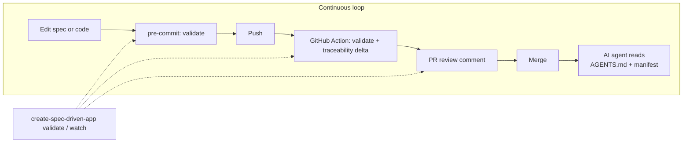
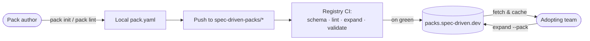
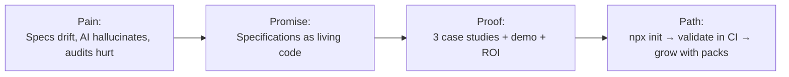
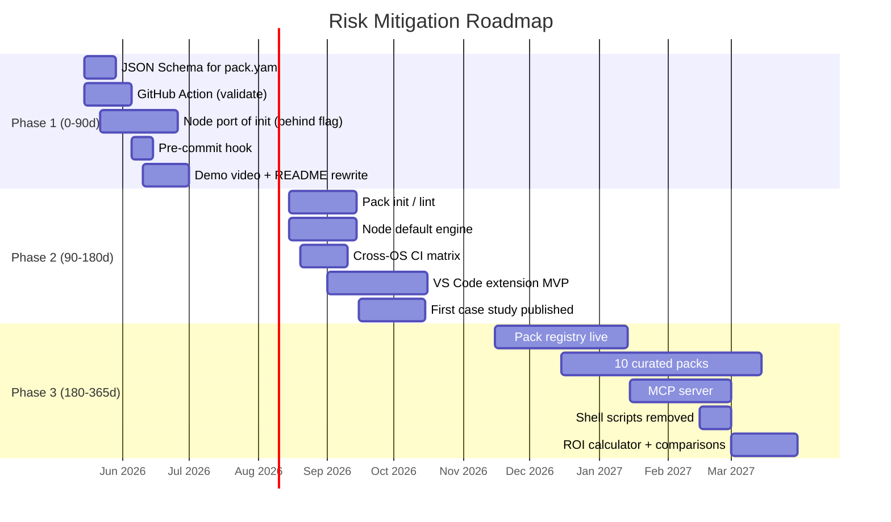

# Strategic Risk Mitigation Plan

> A high-level, actionable plan that addresses the four structural risks
> identified for `create-spec-driven-app` and turns them into a defensible
> product strategy.

---

## 1. Executive Summary

`create-spec-driven-app` operates in a fast-growing space — AI-assisted
software delivery — where structured specifications are quickly becoming
table stakes. The current implementation captures the right ideas but
exposes four real risks that limit enterprise adoption and long-term
retention. This plan converts each risk into a concrete program of work,
maps the deliverables to file-level changes, and proposes a phased
roadmap with measurable success criteria.

**The four risks at a glance:**

| #   | Risk                                                 | Strategic response                                            |
| --- | ---------------------------------------------------- | ------------------------------------------------------------- |
| R1  | The tool is a scaffolder, not a continuous companion | Become a **continuous specification gate** integrated into CI, IDE and AI agents. |
| R2  | `pack.yaml` format introduces adoption friction      | Build a **pack ecosystem**: JSON Schema, registry, generator, curated catalogue. |
| R3  | Bash + `sed` scaffolding is fragile cross-platform   | Migrate to a **Node-based, deterministic engine** with a cross-OS test matrix. |
| R4  | Value proposition is hard to communicate quickly     | Invest in **proof, narrative and ROI** — case studies, a 90-second demo, a landing site rewrite. |

The plan is sequenced over three phases (90 / 180 / 365 days) so that
early wins fund the larger investments.

---

## 2. Risk Inventory

| Risk | Description | Current evidence | Impact if unaddressed |
| ---- | ----------- | ---------------- | --------------------- |
| **R1 — Single-use scaffolder** | Users invoke `npx` once, then forget the tool. Retention is structurally low. | No CI integration ships out of the box; `validate` is documented as a manual command. | Low recurring usage; the tool becomes a one-shot bootstrap, not infrastructure. |
| **R2 — Bespoke `pack.yaml`** | The pack format is proprietary, lacks editor support, has no public catalogue, and no scaffolder of its own. | Only one fixture ships (`parking-management`). No JSON Schema. No registry. | Each team must hand-author packs; network effects never materialise. |
| **R3 — Fragile shell scaffolding** | `new_spec_project.sh` and `validate_specs.sh` rely on Bash, `sed`, and POSIX assumptions that break on Windows-without-WSL and on stripped-down container images. | Pure Bash; no Windows CI matrix; templates rely on `sed` substitution. | Enterprise on-prem and Windows-heavy teams hit blockers during onboarding. |
| **R4 — Diffuse value proposition** | "SDD + DDD + BDD + TDD + Docker + AI" is too many concepts to land in a 30-second pitch. | README is comprehensive but lacks a single narrative, a demo video, or a public case study. | Adoption stalls at the curious-but-unconvinced stage. |

---

## 3. R1 — From Scaffolder to Continuous Companion

**Strategic intent.** Reframe the tool from a one-shot generator into the
**living quality gate** of a specification-first repository. The
specification tree should be enforced on every push, every pull request,
every editor save, and every AI agent action.

### 3.1 Deliverables

| Workstream | Deliverable | Affected files |
| ---------- | ----------- | -------------- |
| GitHub Action | A reusable composite action `rsaglobaltech/spec-driven-action` that runs `validate` on PR and pushes a checks-summary comment with the traceability delta. | New repo `actions/spec-driven-action/action.yml`; reference in `templates/base/.github/workflows/specs.yml.tpl`. |
| Pre-commit hook | A `pre-commit` (https://pre-commit.com) hook id `validate-specs` so contributors get feedback before push. | `templates/base/.pre-commit-config.yaml.tpl`. |
| Watch mode | `create-spec-driven-app watch` command that re-runs `validate` on every change. | New `scripts/watch_specs.js`; CLI dispatcher entry. |
| IDE integration | A VS Code extension that surfaces `validate` errors inline, navigates traceability links, and lints `pack.yaml`. | New repo `vscode-spec-driven`; consumes the JSON Schemas from R2. |
| AI-agent contract | A machine-readable `AGENTS.md` and `.spec-driven/agent-manifest.json` so coding agents discover requirements, scenarios and rules without scraping. | New `templates/base/AGENTS.md.tpl`, `templates/base/.spec-driven/agent-manifest.json.tpl`. |
| Telemetry (opt-in) | Anonymous, opt-in `npx` invocation counter to measure retention. | `bin/create-spec-driven-app.js` (with explicit consent prompt). |

### 3.2 Operating model

### 3.3 Success metrics

- **≥ 60 %** of generated projects keep the GitHub Action enabled three
  months after init (measured through opt-in telemetry).
- Median number of `validate` invocations per repo per week ≥ **5**.
- The VS Code extension reaches **1 000** installs by end of phase 2.

---

## 4. R2 — From Bespoke Format to a Pack Ecosystem

**Strategic intent.** Treat `pack.yaml` as a **product in its own
right**: a public, schema-validated, discoverable format with first-class
tooling. Adoption follows when authoring a pack is easier than not.

### 4.1 Deliverables

| Workstream | Deliverable | Affected files |
| ---------- | ----------- | -------------- |
| **JSON Schema** | A canonical `schemas/pack.schema.json` (draft 2020-12) with `$id` and editor-friendly descriptions. Editors auto-complete via the `$schema` header. | `schemas/pack.schema.json`; update every fixture to include `# yaml-language-server: $schema=…`. |
| **Pack generator** | `create-spec-driven-app pack init` — an interactive command that produces a valid `pack.yaml` from prompts. | New `scripts/init_pack.js`. |
| **Pack linter** | `create-spec-driven-app pack lint <path>` — semantic checks beyond the schema (orphan references, missing scenarios, duplicate IDs). | New `scripts/lint_pack.js`. |
| **Public registry** | A static registry at `packs.spec-driven.dev` (Cloudflare Pages) that indexes `*.pack.yaml` from a curated GitHub org `spec-driven-packs`. Each pack has README, version, license, screenshots of generated artefacts. | New repo `spec-driven-packs/registry`; static site under `docs/registry/`. |
| **Curated catalogue (v1)** | Author and publish ten reference packs covering recurring enterprise domains: `auth`, `billing`, `multi-tenant`, `audit-log`, `notifications`, `feature-flags`, `file-storage`, `search`, `reporting`, `webhooks`. | New repos under `spec-driven-packs/*`. |
| **Versioning** | Adopt SemVer for `pack.yaml` (`schemaVersion`) and packs themselves. Document the upgrade path in `docs/specs/domain-pack-format.md`. | `docs/specs/domain-pack-format.md`; `scripts/expand_domain_pack.js` migration helpers. |
| **Pack tests** | Each curated pack ships with a `tests/` folder exercising `expand` + `validate` against it; CI runs them on every release. | New `.github/workflows/packs-matrix.yml`. |

### 4.2 Discovery model

### 4.3 Success metrics

- **≥ 25** community-contributed packs in the registry within 12 months.
- **100 %** of registry packs pass schema + lint + expand + validate in
  CI.
- Median time to author a new pack with `pack init` ≤ **30 minutes**.

---

## 5. R3 — A Deterministic, Cross-Platform Engine

**Strategic intent.** Eliminate the Bash + `sed` substrate. The CLI must
run identically on Linux, macOS, and native Windows, with deterministic
output and structured error messages.

### 5.1 Deliverables

| Workstream | Deliverable | Affected files |
| ---------- | ----------- | -------------- |
| **Node port of `init`** | Replace `scripts/new_spec_project.sh` with `scripts/init_project.js`. Use a real template engine (e.g. `eta` or `handlebars`) instead of `sed`. Keep CLI flags identical for backwards compatibility. | `scripts/init_project.js`; deprecate `scripts/new_spec_project.sh` with a one-release shim. |
| **Node port of `validate`** | Replace `scripts/validate_specs.sh` with `scripts/validate_project.js`. Return structured JSON results (machine-readable for CI + IDE). | `scripts/validate_project.js`; keep the shell wrapper for compatibility. |
| **Template engine** | Move all templates from string interpolation to a single engine with explicit escaping. Introduce `.eta` / `.hbs` extensions. | `templates/**/*.tpl` → renamed and ported. |
| **Cross-OS CI matrix** | GitHub Actions matrix over `{ubuntu-latest, macos-latest, windows-latest}` × `{node 18, 20, 22}`. | `.github/workflows/ci.yml`. |
| **Deterministic output** | Lock file mtimes, normalise line endings (`.gitattributes` with `text=auto eol=lf`), sort generated YAML keys. Add a golden-file test that compares two `init` runs byte-for-byte. | `tests/snapshot/init-determinism.test.js`. |
| **Structured errors** | All CLI failures emit JSON to stderr when `--json` is passed: `{ code, message, hint, docs_url }`. | `bin/create-spec-driven-app.js`. |
| **Single binary distribution (optional)** | Bundle the CLI with `pkg` or `vercel/ncc` for offline / air-gapped enterprise use. | `.github/workflows/release.yml`. |

### 5.2 Compatibility strategy

- Phase 1 ships the Node implementation **behind a flag** (`--engine=node`)
  with parity tests against the shell version.
- Phase 2 flips the default; the shell scripts remain as a thin
  compatibility shim for one minor release.
- Phase 3 removes the shell scripts entirely.

### 5.3 Success metrics

- CI green on Windows / macOS / Linux for every PR.
- Zero ShellCheck-class defects (because shell is gone or vestigial).
- Snapshot determinism: `init --config X` twice produces a byte-identical
  tree.
- Time-to-first-success on Windows native (no WSL) ≤ **3 minutes** from a
  clean install.

---

## 6. R4 — Proof, Narrative and Return on Investment

**Strategic intent.** Replace the conceptual pitch with **evidence**.
Decision-makers buy outcomes: hours saved, defects prevented, audits
passed. The artefacts below make those outcomes legible in under two
minutes.

### 6.1 Deliverables

| Workstream | Deliverable | Affected files |
| ---------- | ----------- | -------------- |
| **Reference case studies** | Three written case studies (≈ 1 500 words each) with quantified before / after metrics from real teams. Anonymised if necessary. | `docs/case-studies/{case-1,case-2,case-3}.md`; surfaced in the docs site. |
| **90-second demo video** | A single-take screencast: `npx init` → review specs → `expand` a pack → AI agent implements a scenario → `validate` passes. Hosted on the docs site. | `docs/assets/demo.mp4`; embedded in `docs/index.html`. |
| **Landing page rewrite** | Restructure the docs site around one promise (e.g. "Ship specifications, not just code"), one demo, three case studies, one CTA. | `docs/index.html`, `docs/app.js`, `docs/styles.css`. |
| **Comparison matrix** | Honest comparison against `spec-kit`, Cursor rules, Aider conventions, plain-README workflows. State trade-offs openly. | `docs/comparisons.md`. |
| **ROI calculator** | A simple form (10 inputs: team size, projects/year, hours-to-clarity baseline, defect rate, …) that returns an annualised savings estimate. | `docs/roi.html` (static, JS-only). |
| **Quickstart that fits one screen** | A README "Quickstart" of at most 10 lines and 60 seconds, from zero to a validated project. | `README.md`. |
| **Workshops and templates** | A two-hour workshop deck and a half-day workshop deck under `docs/workshops/`. | `docs/workshops/*.md`. |

### 6.2 Narrative blueprint

### 6.3 Success metrics

- Docs-site → `npx init` conversion ≥ **5 %** (measured via opt-in
  telemetry).
- ≥ **3** named public case studies within 12 months.
- Inbound enterprise enquiries ≥ **1 per month** by end of phase 2.
- Mean time-to-pitch (the time a developer needs to explain the tool to
  their lead) under **2 minutes** in user interviews.

---

## 7. Strategic Axes Across All Risks

Three cross-cutting axes amplify the impact of the risk-specific work.

### 7.1 AI-agent integration

The single biggest unlock. Agents are first-class consumers of
specifications and benefit disproportionately from them.

- Ship `AGENTS.md` and `.spec-driven/agent-manifest.json` (see R1.1).
- Author a **first-party Claude / OpenAI / Cursor / Aider integration
  guide** describing how the agent should read the manifest, propose
  spec updates, and stay inside `AI_RULES.md`.
- Build a **`spec-driven` MCP server** so any MCP-aware agent exposes
  `read_spec`, `update_traceability`, `lint_pack`, `validate_project` as
  tools.
- Files: new repo `mcp-spec-driven` with `server.ts`, manifest, and a
  GitHub release pipeline.

### 7.2 Continuous validation

Make `validate` ambient.

- GitHub Action with PR check + sticky comment (see R1).
- Pre-commit hook (see R1).
- Optional GitLab CI / Azure DevOps templates for enterprise users.
- A `validate --watch --serve` dashboard at `localhost:4317` for live
  feedback during workshops.

### 7.3 Pack marketplace and ecosystem

Network effects compound only if authoring a pack is delightful.

- `pack init`, `pack lint`, `pack publish` (see R2).
- Registry at `packs.spec-driven.dev`.
- A `spec-driven-packs` GitHub org for curated packs, with a clear
  contribution guide and a code-of-conduct.
- Quarterly "pack of the quarter" call-out in the changelog.

---

## 8. Phased Roadmap

### 8.1 Phase 1 — Foundations (0–90 days)

Objective: stop the bleeding. Make `validate` ambient and the format
discoverable in editors.

- **R1**: GitHub Action; pre-commit hook; `AGENTS.md` template.
- **R2**: JSON Schema for `pack.yaml`; `$schema` header in every fixture.
- **R3**: Node implementation of `init` behind `--engine=node`; parity
  tests.
- **R4**: 90-second demo; README rewrite; one anonymised case study.

Investment estimate: **1.5 FTE × 3 months**.

### 8.2 Phase 2 — Foundations made default (90–180 days)

Objective: flip defaults; turn the early wins into the standard
experience.

- **R1**: VS Code extension MVP; watch mode; opt-in telemetry.
- **R2**: `pack init` + `pack lint`.
- **R3**: Node engine becomes default; cross-OS CI matrix.
- **R4**: Second case study; comparison matrix; revised landing page.

Investment estimate: **2 FTE × 3 months** (one engineer, one
developer-advocate / technical writer).

### 8.3 Phase 3 — Ecosystem (180–365 days)

Objective: turn the tool into infrastructure. Network effects begin.

- **R1**: MCP server; first-party agent integration guides.
- **R2**: Registry live; ten curated packs; quarterly cadence.
- **R3**: Shell scripts removed; single-binary distribution.
- **R4**: Third case study; ROI calculator; workshop programme.

Investment estimate: **2.5 FTE × 6 months**.

---

## 9. Success Metrics (Consolidated)

| Dimension              | Metric                                                          | Target (12 months)   |
| ---------------------- | --------------------------------------------------------------- | -------------------- |
| Retention              | `validate` invocations per active repo per week                 | ≥ 5                  |
| Retention              | Generated projects with CI gate still enabled at 90 days        | ≥ 60 %               |
| Ecosystem              | Community packs in the registry                                 | ≥ 25                 |
| Ecosystem              | Median time to author a new pack with `pack init`               | ≤ 30 minutes         |
| Reliability            | Cross-OS CI green rate                                          | ≥ 99 %               |
| Reliability            | Determinism (byte-identical init output)                        | 100 %                |
| Adoption               | Docs → `npx init` conversion                                    | ≥ 5 %                |
| Adoption               | Named public case studies                                       | ≥ 3                  |
| Quality                | Schema-validated `pack.yaml` files across registry              | 100 %                |
| AI-agent integration   | MCP server downloads                                            | ≥ 2 000              |
| Developer experience   | VS Code extension installs                                      | ≥ 1 000              |

---

## 10. Investment and Team Shape

| Role                              | Phase 1 | Phase 2 | Phase 3 |
| --------------------------------- | ------- | ------- | ------- |
| Tech lead / maintainer            | 1.0     | 1.0     | 1.0     |
| Build / DevEx engineer            | 0.5     | 0.5     | 1.0     |
| Developer advocate / tech writer  | 0.0     | 0.5     | 0.5     |
| Designer (landing, registry UI)   | 0.0     | 0.2     | 0.3     |
| **Total FTE**                     | **1.5** | **2.2** | **2.8** |

Funding model options: maintainer-led open-source, GitHub Sponsors,
foundation grant, or an enterprise support tier (priority issues, paid
workshops, on-prem registry mirror).

---

## 11. Decision Checkpoints

The plan is structured around three "stop / proceed / pivot" gates so
that investment scales only when evidence justifies it.

| Gate         | Date       | Pass criteria                                                                                | Decision options          |
| ------------ | ---------- | -------------------------------------------------------------------------------------------- | ------------------------- |
| End of P1    | day 90     | GitHub Action published; JSON Schema released; demo video live; ≥ 50 stars added since start. | proceed / extend / pivot  |
| End of P2    | day 180    | Node engine default; ≥ 1 000 monthly active repos using `validate`; first case study public. | proceed / extend / pivot  |
| End of P3    | day 365    | ≥ 25 community packs; MCP server stable; ≥ 3 case studies; first paying enterprise customer. | scale / steady-state      |

Each gate is paired with an open retrospective (`docs/retros/phase-N.md`)
and an updated roadmap.

---

## 12. Conclusion

The four risks identified are real, but each maps cleanly to a tractable
program of work. Phase 1 alone — a JSON Schema, a GitHub Action, a Node
implementation behind a flag, and a 90-second demo — already shifts the
product from "a curious scaffolder" to "an ambient quality gate with a
credible roadmap". The subsequent phases compound from there. Executed
in sequence, this plan moves `create-spec-driven-app` from a useful
generator to a piece of infrastructure that enterprise teams actively
choose to keep in their pipeline.

---

## 13. References

- Beck, Kent. *Tidy First?* O'Reilly, 2023.
- Brooks, Frederick. *The Mythical Man-Month*, anniversary ed. Addison-Wesley, 1995.
- Cagan, Marty. *Inspired*, 2nd ed. Wiley, 2018.
- Christensen, Clayton. *The Innovator's Dilemma.* Harvard Business Review Press, 1997.
- Evans, Eric. *Domain-Driven Design.* Addison-Wesley, 2003.
- Forsgren, Humble and Kim. *Accelerate.* IT Revolution Press, 2018.
- Kim, Gene et al. *The DevOps Handbook.* IT Revolution Press, 2016.
- Moore, Geoffrey. *Crossing the Chasm*, 3rd ed. HarperBusiness, 2014.
- Reis, Eric. *The Lean Startup.* Crown, 2011.
- Wiggins, Adam. *The Twelve-Factor App.* https://12factor.net.
